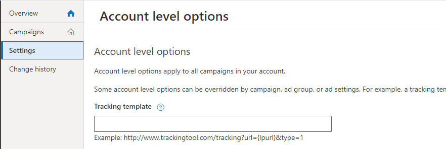
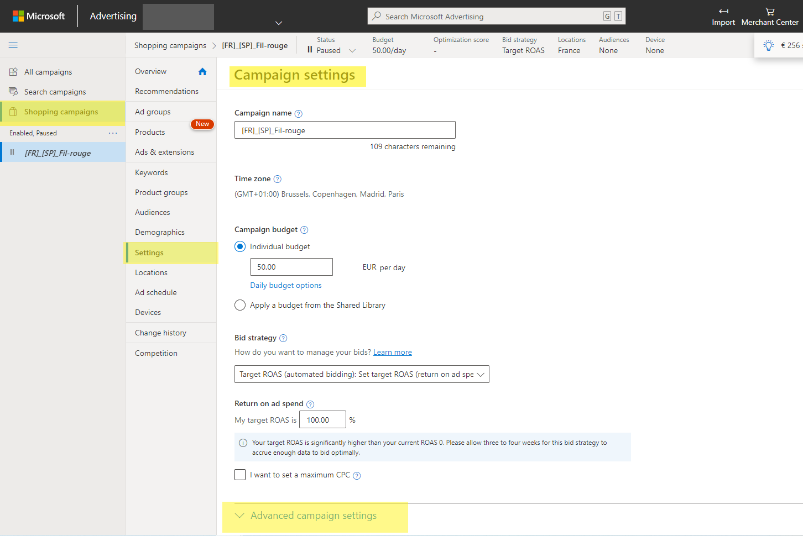
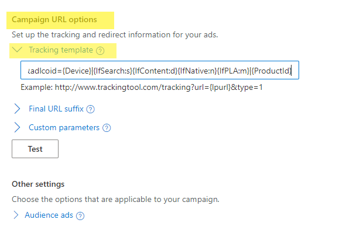

Bing Search Campaigns use the default account level URL template

For DSA or Shopping Campaigns refer to the specific parameters

## a.  Bing Search campaigns 

| Account level | 
| On the left menu : click on  _Setting_ > _Account level options_ > _Tracking template_  | 
|  _loopcd_ (for all analytics platforms including Adobe, Google or Piano Analytics)using the  _utm_content_  parameter in substitution is possible (only for Google Analytics) | 
|  **If Adloop is the only tracking template** , just copy-paste the following{lpurl}?loopcd=SEb|{Device}|{IfSearch:s}{IfContent:d}{IfNative:n}{IfPLA:m}|{keyword:no_kw}|{AdId}|{MatchType}Just add the following string at the end of the destination URL&loopcd=SEb|{Device}|{IfSearch:s}{IfContent:d}{IfNative:n}{IfPLA:m}|{keyword:no_kw}|{AdId}|{MatchType}If you opt for the  _utm_content_ , use this value : &utm_content=SEb|{Device}|{IfSearch:s}{IfContent:d}{IfNative:n}{IfPLA:m}|{keyword:no_kw}|{AdId}|{MatchType} | 
| No, just chose one parameter and keep it consistent for all Bing Campaigns for now and the future  | 
|  --- | 
|  --- | 
|  --- | 
|  --- | 
|  --- | 
| Account level | 
| On the left menu : click on  _Setting_ > _Account level options_ > _Tracking template_  | 
|  _loopcd_ (for all analytics platforms including Adobe, Google or Piano Analytics)using the  _utm_content_  parameter in substitution is possible (only for Google Analytics) | 
|  **If Adloop is the only tracking template** , just copy-paste the following{lpurl}?loopcd=SEb|{Device}|{IfSearch:s}{IfContent:d}{IfNative:n}{IfPLA:m}|{keyword:no_kw}|{AdId}|{MatchType}Just add the following string at the end of the destination URL&loopcd=SEb|{Device}|{IfSearch:s}{IfContent:d}{IfNative:n}{IfPLA:m}|{keyword:no_kw}|{AdId}|{MatchType}If you opt for the  _utm_content_ , use this value : &utm_content=SEb|{Device}|{IfSearch:s}{IfContent:d}{IfNative:n}{IfPLA:m}|{keyword:no_kw}|{AdId}|{MatchType} | 
| No, just chose one parameter and keep it consistent for all Bing Campaigns for now and the future  | 

## b.  DSA campaigns 

| Campaign level | 
| For each campaign: Campaign settings > Advanced setting > campaign URL options | 
|  _loopcd_ (for all analytics platforms including Adobe, Google or Piano Analytics)using the  _utm_content_  parameter in substitution is possible (only for Google Analytics) | 
|  **If Adloop is the only tracking template** , just copy-paste the following{lpurl}?loopcd=SEb|{Device}|{IfSearch:s}{IfContent:d}{IfNative:n}{IfPLA:m}||{AdId}|{MatchType}Just add the following string at the end of the destination URL&loopcd=SEb|{Device}|{IfSearch:s}{IfContent:d}{IfNative:n}{IfPLA:m}||{AdId}|{MatchType}If you opt for the  _utm_content_ , use this value : &utm_content=SEb|{Device}|{IfSearch:s}{IfContent:d}{IfNative:n}{IfPLA:m}||{AdId}|{MatchType} | 
| No, just chose one parameter and keep it consistent for all Bing Campaigns for now and the future  | 
|  --- | 
|  --- | 
|  --- | 
|  --- | 
|  --- | 
| Campaign level | 
| For each campaign: Campaign settings > Advanced setting > campaign URL options | 
|  _loopcd_ (for all analytics platforms including Adobe, Google or Piano Analytics)using the  _utm_content_  parameter in substitution is possible (only for Google Analytics) | 
|  **If Adloop is the only tracking template** , just copy-paste the following{lpurl}?loopcd=SEb|{Device}|{IfSearch:s}{IfContent:d}{IfNative:n}{IfPLA:m}||{AdId}|{MatchType}Just add the following string at the end of the destination URL&loopcd=SEb|{Device}|{IfSearch:s}{IfContent:d}{IfNative:n}{IfPLA:m}||{AdId}|{MatchType}If you opt for the  _utm_content_ , use this value : &utm_content=SEb|{Device}|{IfSearch:s}{IfContent:d}{IfNative:n}{IfPLA:m}||{AdId}|{MatchType} | 
| No, just chose one parameter and keep it consistent for all Bing Campaigns for now and the future  | 

## c.  Shopping campaigns

| Campaign level | 
| For each campaign: Campaign settings > Advanced setting > campaign URL options | 
|  _loopcd_ (for all analytics platforms including Adobe, Google or Piano Analytics)using the  _utm_content_  parameter in substitution is possible (only for Google Analytics) | 
|  **If Adloop is the only tracking template** , just copy-paste the following{lpurl}?loopcd=COb|{Device}|{IfSearch:s}{IfContent:d}{IfNative:n}{IfPLA:m}|{ProductId}Just add the following string at the end of the destination URL&loopcd=COb|{Device}|{IfSearch:s}{IfContent:d}{IfNative:n}{IfPLA:m}|{ProductId}If you opt for the  _utm_content_ , use this value : &utm_content=COb|{Device}|{IfSearch:s}{IfContent:d}{IfNative:n}{IfPLA:m}|{ProductId} | 
| No, just chose one parameter and keep it consistent for all Bing Campaigns for now and the future  | 
|  --- | 
|  --- | 
|  --- | 
|  --- | 
|  --- | 
| Campaign level | 
| For each campaign: Campaign settings > Advanced setting > campaign URL options | 
|  _loopcd_ (for all analytics platforms including Adobe, Google or Piano Analytics)using the  _utm_content_  parameter in substitution is possible (only for Google Analytics) | 
|  **If Adloop is the only tracking template** , just copy-paste the following{lpurl}?loopcd=COb|{Device}|{IfSearch:s}{IfContent:d}{IfNative:n}{IfPLA:m}|{ProductId}Just add the following string at the end of the destination URL&loopcd=COb|{Device}|{IfSearch:s}{IfContent:d}{IfNative:n}{IfPLA:m}|{ProductId}If you opt for the  _utm_content_ , use this value : &utm_content=COb|{Device}|{IfSearch:s}{IfContent:d}{IfNative:n}{IfPLA:m}|{ProductId} | 
| No, just chose one parameter and keep it consistent for all Bing Campaigns for now and the future  | 

*****

[[category.storage-team]] 
[[category.confluence]] 
